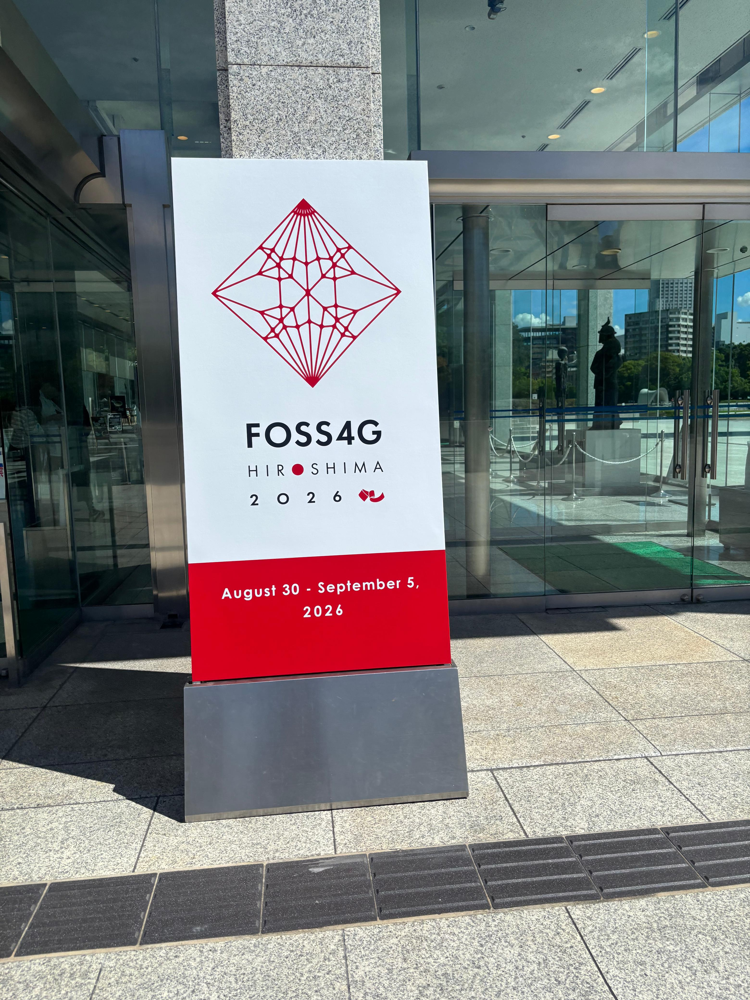
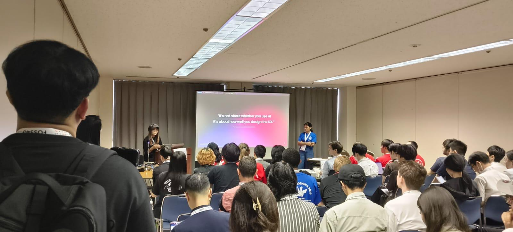
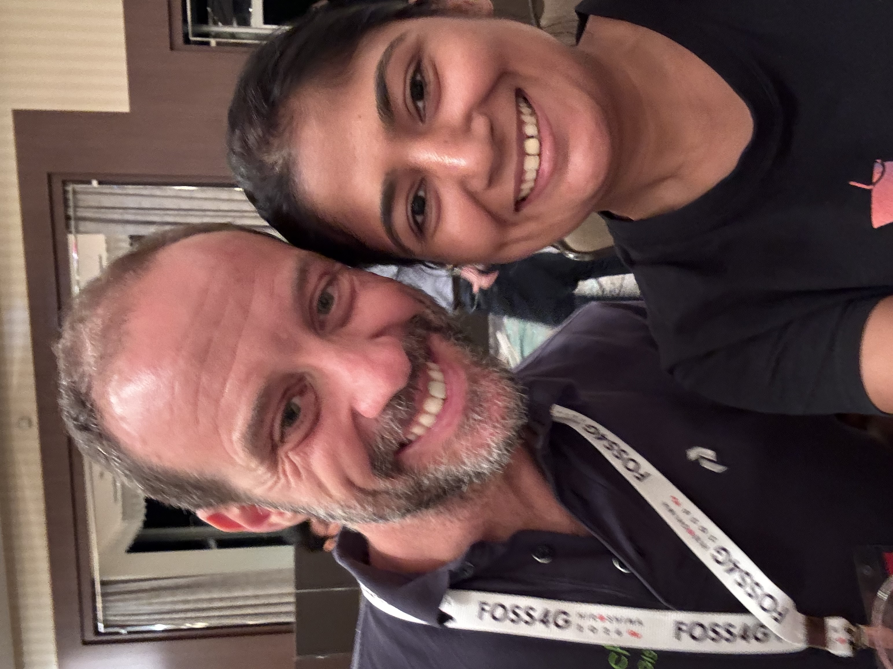
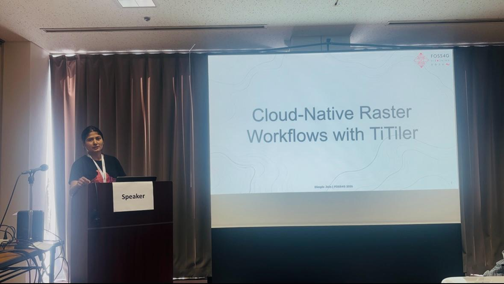
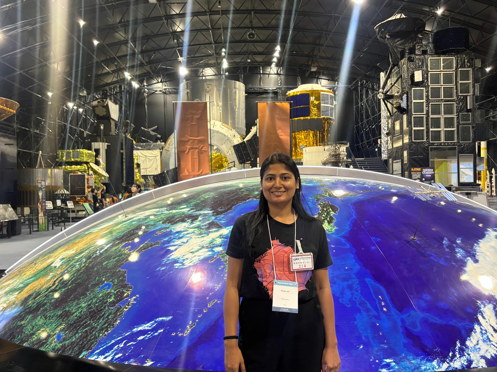
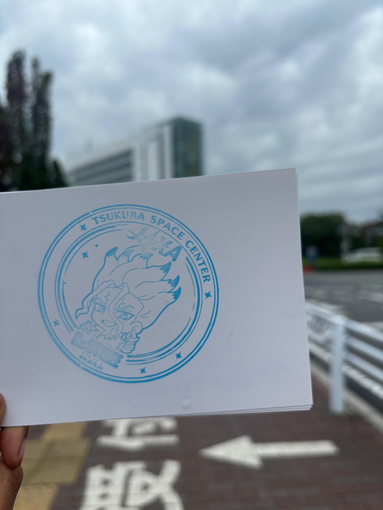

When I got to know that in 2026 FOSS4G was happening in Japan, I made a whole list of must-do things and, of course, a long shopping list.

I was there for almost half a month, and still it felt very short. So I already know that I have to visit again.

This was my second Global FOSS4G conference. Nothing can really match the energy of the FOSS4G organising team. Everyone in the conference is so enthusiastic, ready to help, and open to talk about anything.

This time, I was also meeting many familiar faces for the second time, and of course my bestie Kauve.

I was volunteering during the conference, and I think this is one of the best ways to know more about the local organising team. You get to see how much work goes behind the conference and how people manage everything.

And this is where I kept thinking about one thing.

What is it about Japanese culture, society or environment that makes people so disciplined?

Everything was on time.

Not before.

Not after.

Just exactly on time.

I kept noticing these small things again and again.

The Gala Dinner and Ice Breaker were so much fun. I also joined the Japanese dancing in a happi coat.

I got the chance to talk to Marco Bernasocchi as well. He remembered me, which made me very happy, because we had met before at FOSS4G in Kosovo, once.

This is something I really like about the open-source community. You meet someone in one country, and then after a few years, you meet the same person somewhere else in the world. But in between, you are never really disconnected from them. You are still reading their blogs, following their work, listening to their talks, or seeing their contributions. So when you meet again after a few years, it somehow doesn't feel like you are meeting after such a long time.

## My talk

I also presented my talk on **"Cloud-Native Raster Workflows with TiTiler."** You can find more details [here](https://talks.osgeo.org/foss4g-2026/talk/review/VGRHEAW9MCADDSH8A8NF73XF3LCCPNTC).

Before the conference, there was also a STAC sprint at JAXA. Honestly, entering JAXA itself felt like a dream. So actually going there felt very special to me.

<table>
<tr>
<td></td>
<td></td>
</tr>
</table>

## The thing I really want to share

But apart from the conference, there is one thing about Japan that I really want to share.

On the first day, we reached around midnight. With all the excitement, my husband and I forgot to buy a SIM card in or outside the airport. We directly took the subway towards our Airbnb.

When our internet stopped working we realised that we needed a SIM card. When we came out of the metro station, there were no shops around us, and we were not sure which direction to go because we couldn't use Maps.

One Japanese man helped us. Not only did he tell us the direction, he actually came with us and dropped us to our Airbnb. And it was in the opposite direction from where he was going.

I want to be very honest here. As a woman, the first thought that came to my mind was:

Why is he helping us so much? What if he takes us somewhere else? That was my first thought.

But he simply helped us reach our Airbnb and then went back. From that point, I started noticing how people were genuinely helping us in many small situations.

Of course, I am not saying that everyone in Japan is perfect or that Japan doesn't have problems. Every place has its own problems. But I kept thinking about one thing. What does a culture, society or environment teach people that makes them help someone even when nobody is watching? When there is nothing to gain from it?

For me, that is something I was not able to digest.

And Japan made me think a lot about this. Another thing was queues. For the first few days, I was actually getting very impatient. Why is there a queue? Why do we have to wait so much?

I was getting irritated. Then after a few days, I realised, Maybe the question is not why they are standing in the queue. Maybe the question is why I am getting so impatient.

Why do I always want things faster? Why do I get anxious when I have to wait and follow an order?

And then I started thinking that maybe our culture, society and environment also shape us in the same way. Maybe this impatience also comes from somewhere.

This trip made me think more about behaviour, trust, public spaces, discipline, patience and the small things a society quietly teaches us.
